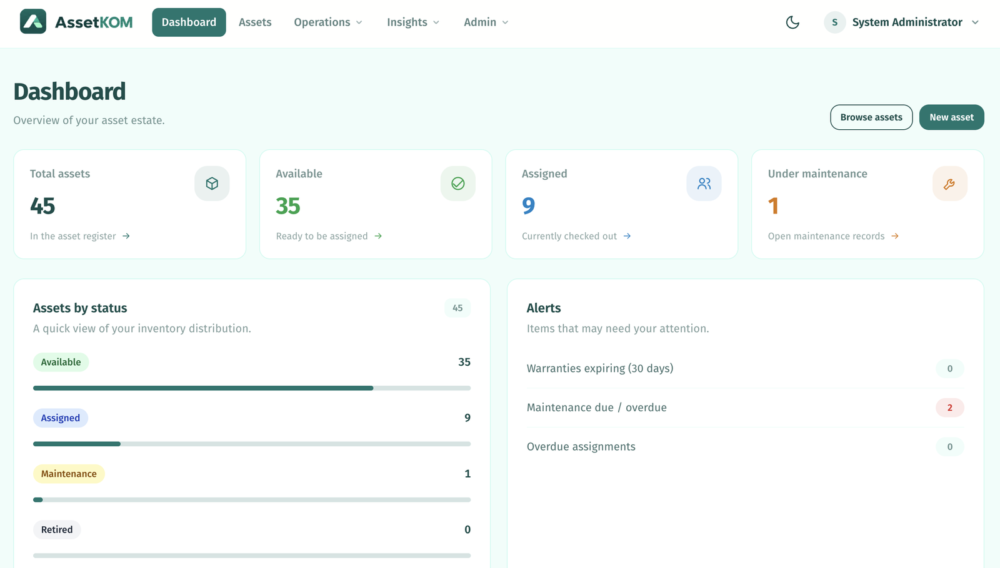
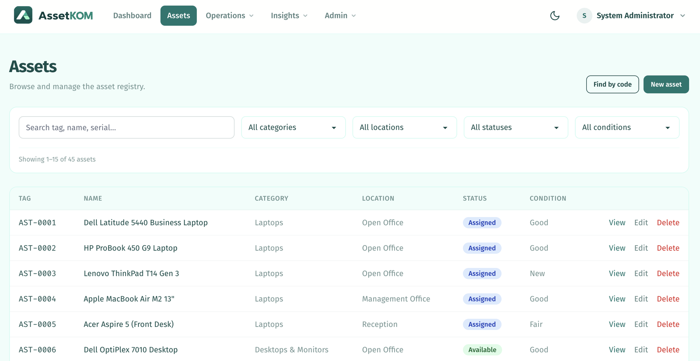
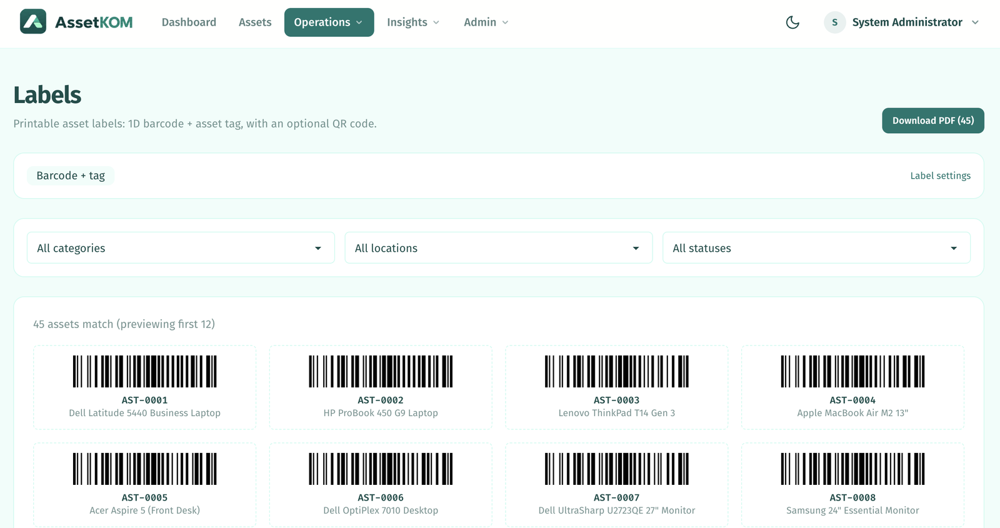
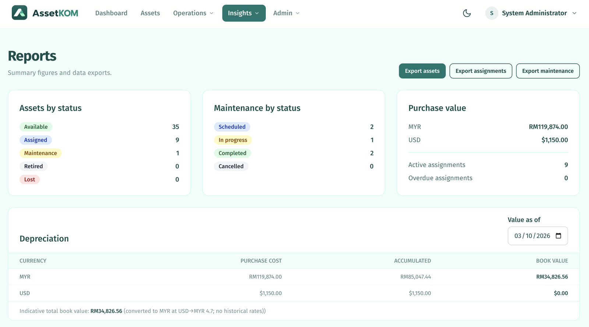
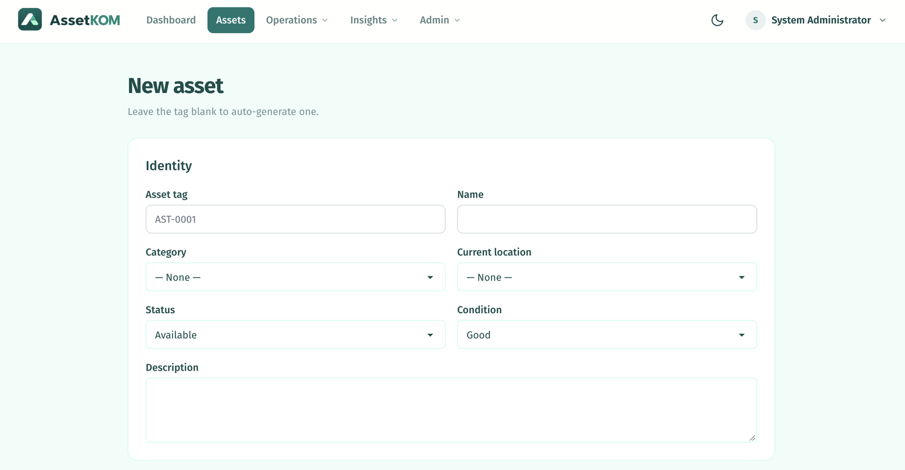
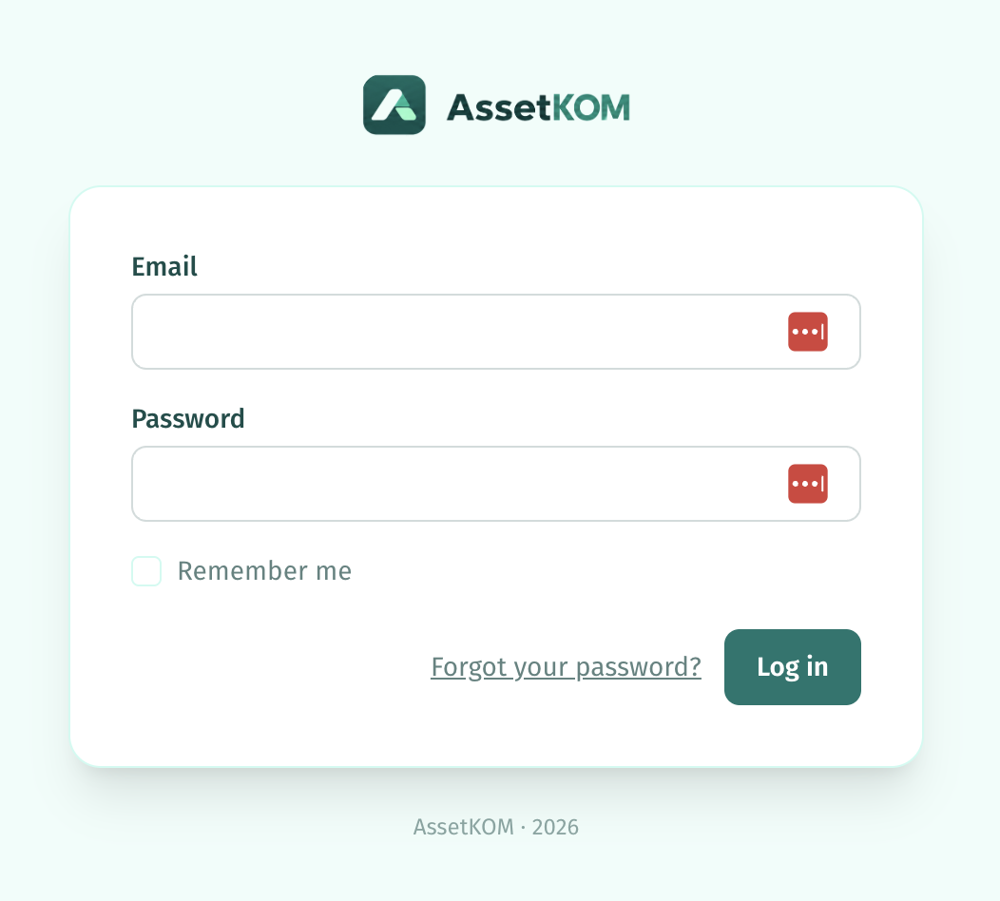

# AssetKOM

Open-source asset management for small and medium organisations.

Track your company's laptops, equipment, vehicles, furniture, tools and other assets — without
spreadsheets.

## Why AssetKOM?

- ✓ Know **who has every asset**, and where it is
- ✓ **Barcode labels** + scan/type **code lookup** (QR optional)
- ✓ **Check-in / check-out** with full history
- ✓ **Maintenance & warranty tracking**
- ✓ **Depreciation** (straight-line or reducing balance)
- ✓ **Audit history**
- ✓ **CSV import** (column mapping, dry-run, idempotent)
- ✓ **Location hierarchy**
- ✓ **Role-based access** (Admin / Manager / Staff)

## Screenshots

| Dashboard | Asset registry |
|---|---|
|  |  |

| Labels (1D barcode + tag) | Reports & depreciation |
|---|---|
|  |  |

| New asset | Login |
|---|---|
|  |  |

## Features

- **Asset registry** — assets with categories, locations, photos, JSON custom fields and
  auto-generated asset tags.
- **Assignments** — transactional check-out / check-in to people or locations, with full history.
- **Maintenance** — scheduled / in-progress / completed records with cost tracking; drives the
  asset status lifecycle.
- **Attachments** — polymorphic document uploads stored on a private disk with authorized downloads.
- **Labels** — printable 1D barcode + asset-tag labels (single and bulk PDFs), with optional
  QR codes, plus a scan/type **code lookup** to jump straight to an asset.
- **Depreciation** — straight-line or reducing-balance book value, with a configurable rate and a
  "value as of" date.
- **Dashboard & reports** — estate overview, alerts, per-currency summaries and CSV exports.
- **Audit log** — activity trail on assets, assignments and maintenance.
- **Daily alerts** — queued email digests for warranty expiry, maintenance due and overdue
  assignments, with per-user preferences.
- **CSV import** — column mapping, dry-run validation and idempotent upserts by asset tag.

## Roles

| Capability | Admin | Manager | Staff |
|---|---|---|---|
| Manage users | ✅ | — | — |
| Categories / locations / settings | ✅ | ✅ | — |
| Create / edit assets | ✅ | ✅ | — |
| Delete assets | ✅ | — | — |
| Check-out / in, maintenance, attachments | ✅ | ✅ | ✅ |
| View assets | ✅ | ✅ | ✅ |
| Reports, exports, audit log, import | ✅ | ✅ | — |

## Tech stack

Laravel 13 · PHP 8.4 · Livewire 3 + Volt · Tailwind CSS + daisyUI · Vite · SQLite (dev) / MySQL (prod) ·
PHPUnit test suite · dompdf, picqer/php-barcode-generator, endroid/qr-code, league/csv,
spatie/laravel-activitylog.

## Try it locally

**Requirements:** PHP 8.4 (with `pdo_sqlite`, `mbstring`, `gd`), Composer, Node 20+ / npm.

```sh
composer install
cp .env.example .env
php artisan key:generate
touch database/database.sqlite
php artisan migrate --seed
npm install
npm run build
php artisan storage:link
php artisan serve          # http://localhost:9090 (port via APP_PORT)
```

Or run everything at once (server + queue + logs + Vite): `composer dev`.

Demo accounts (password `password`), seeded only in `local`/`testing`:

| Email | Role |
|---|---|
| `admin@assetkom.test` | Administrator |
| `manager@assetkom.test` | Manager |
| `nurul@assetkom.test` | Staff |

Additional staff accounts (`weiming@`, `arun@`, `siti@`, `daniel@`, `farah@assetkom.test`) come
with the demo dataset.

## Going live

Everything you need to run AssetKOM for a real organization:

### Server requirements

- PHP **8.4** with extensions: `pdo_mysql`, `mbstring`, `openssl`, `gd`, `fileinfo`, `curl`, `xml`
- **MySQL/MariaDB** (migrations are engine-portable; SQLite is for development only)
- **Composer** and **Node 20+** (Node is only needed to build frontend assets — run
  `npm ci && npm run build` at deploy time and ship the `public/build` output)
- A process supervisor (systemd/supervisor) for the **queue worker**
- `cron` access for the **scheduler**
- Write access for PHP to `storage/` and `bootstrap/cache/`

### Setup checklist

1. **Point a domain with HTTPS** in front of `public/` (nginx/Apache); set `APP_URL` accordingly.
2. Configure the environment for production:
   ```
   APP_ENV=production
   APP_DEBUG=false
   APP_URL=https://assets.yourorg.com
   DB_CONNECTION=mysql   (+ DB_HOST, DB_DATABASE, DB_USERNAME, DB_PASSWORD)
   ```
   Then `php artisan config:cache route:cache view:cache` after each deploy.
3. `composer install --no-dev --optimize-autoloader` and `php artisan migrate --force`
   (production seeding applies settings only — no demo data).
4. **Create the first administrator explicitly** — public registration is disabled:
   `php artisan admin:create admin@yourorg.com` (prompts for a password). Invite further users
   from the admin's user management screen.
5. **Configure SMTP** so verification and alert emails work: `MAIL_MAILER=smtp` plus
   host/port/username/password. All pages require a **verified** account.
6. **Run a queue worker** under a supervisor (`php artisan queue:work`) — this delivers email
   verification and the daily alert digests.
7. **Add one cron line** (`* * * * * php /path/artisan schedule:run`) — daily alerts run at 08:00.
8. Set `APP_TIMEZONE`, `APP_LOCALE`, default currency and asset-tag prefix in **Settings**.
9. **Back up the database and `storage/app/private`** (attachments live on a private disk).

## Commercial services

AssetKOM is free and open source (MIT). If you'd like help putting it to work, paid assistance is
available:

- Installation & server setup
- Data migration (from spreadsheets or another system)
- Customisation & integrations
- Hosting & maintenance
- Support & training

**Contact:** [borang.digital/maelzx/assetkom-contact](https://borang.digital/maelzx/assetkom-contact)

## Roadmap

Built and shipped: asset registry, assignments, maintenance, attachments, labels + code lookup,
depreciation, dashboard & reports, audit log, email alerts, CSV import, roles/permissions, and a
daisyUI design system with dark mode.

Planned / deferred:

- Camera-based scanning (phones) on top of the existing code lookup
- Stocktake / reconciliation (count sessions, discrepancy review)
- Retirement / disposal lifecycle (dates, reason, disposal value & notes)
- Historical & live FX rates for multi-currency book values
- Profile extras (avatar upload)

## The story behind this project

AssetKOM was built **purely as an AI-assisted development experiment** — could an AI agent and a
human, working together, take a real business application from an empty folder to a finished,
tested, production-hardened system?

The answer, after fourteen implementation phases of planning, coding, reviewing, and hardening, is
yes. Every feature here — from the asset registry to barcode labels, CSV imports, depreciation
schedules, and the daily alert digests — was designed and built with AI pair development
(Laravel Boost, Livewire Volt, and agent-guided testing), then reviewed by a human before
shipping. The repo itself is the proof of what that workflow can produce.

### Built with

The implementation was driven by AI pair development across three models:

- **DeepSeek 4.1 Flash** — primary driver, responsible for roughly **90%** of the planning, code,
  reviews and fixes.
- **OpenAI GPT-6 Luna** — supporting development and review.
- **Alibaba Qwen 3.8 Flash** — supporting development and review.

A human set the direction, reviewed each phase, and approved every change before it shipped.

## Contributing

- **Feature requests / bug reports:** [open an issue](https://github.com/maelzx/AssetKOM/issues).
- **Pull requests:** welcome. Follow the existing conventions — run `php artisan test` and
  `./vendor/bin/pint` before submitting.
- Run `./vendor/bin/pint` before committing PHP changes; keep the SQLite database local.

## License

[MIT](LICENSE) — use it, fork it, sell it to your own clients. Provided as-is, with no warranty of
any kind.
